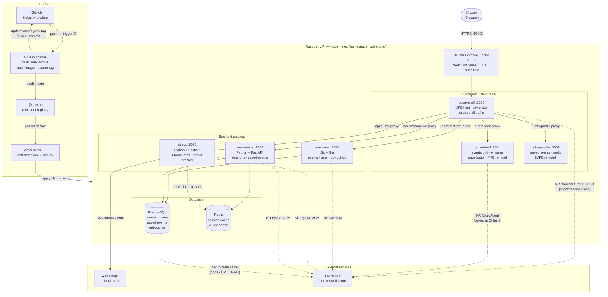

# PULSE

> Real-time city events feed with AI-powered recommendations — built to demo New Relic observability on a live distributed system.

---

## Architecture



**Key design decisions:**

- Only `pulse.test:30443` is exposed — backends and MFE remotes are cluster-internal.
- pulse-shell proxies everything via Next.js `rewrites()`. The browser never leaves `pulse.test:30443`.
- Module Federation: pulse-shell fetches MFE JS chunks from pulse-feed/pulse-profile server-side via proxy, then serves them to the browser. No direct browser-to-MFE traffic.
- NR Browser agent credentials are injected at runtime from K8s env in pulse-shell (`getServerSideProps`), but baked into the Docker image at CI build time for pulse-feed/pulse-profile (Next.js `NEXT_PUBLIC_*` constraint).

---

## Services

| Service | Tech | Port | Description |
|---|---|---|---|
| `pulse-shell` | Next.js 14 (MFE host) | 3000 | App shell, header, city picker, routing |
| `pulse-feed` | Next.js 14 (MFE remote) | 3001 | Events grid, category filter, AI panel, save |
| `pulse-profile` | Next.js 14 (MFE remote) | 3002 | User profile, saved events (Week 2) |
| `event-svc` | Go 1.22 + Gin | 8080 | Events CRUD, user prefs, opt-out logging |
| `ai-svc` | Python 3.12 + FastAPI | 8082 | Claude recommendations, circuit breaker |
| `session-svc` | Python 3.12 + FastAPI | 8081 | Session management, Redis cache, saved events |

---

## Quick Start

### 1. Configure secrets
```bash
cp config.env.example config.env
# Fill in: ANTHROPIC_API_KEY, NEW_RELIC_LICENSE_KEY, NEW_RELIC_ACCOUNT_ID, GITHUB_USER, GITHUB_PAT
```

### 2. Install prerequisites (fresh cluster)
```bash
# local-path StorageClass (for postgres/redis PVCs)
kubectl apply -f https://raw.githubusercontent.com/rancher/local-path-provisioner/v0.0.26/deploy/local-path-storage.yaml

# ArgoCD
kubectl create namespace argocd
kubectl apply -n argocd -f https://raw.githubusercontent.com/argoproj/argo-cd/v3.3.2/manifests/install.yaml
```

### 3. Apply secrets
```bash
kubectl create namespace pulse-prod
chmod +x scripts/apply-secrets.sh
./scripts/apply-secrets.sh pulse-prod

# GHCR pull secret
export $(grep -v '^#' config.env | grep -v '^$' | xargs)
kubectl create secret docker-registry ghcr-secret \
  --docker-server=ghcr.io \
  --docker-username="$GITHUB_USER" \
  --docker-password="$GITHUB_PAT" \
  -n pulse-prod --dry-run=client -o yaml | kubectl apply -f -
```

### 4. Deploy via ArgoCD
```bash
kubectl apply -f argocd/app-of-apps.yaml
```

### 5. Seed the database
```bash
cat db/seed.sql | kubectl exec -i -n pulse-prod postgresql-0 -- psql -U pulse -d pulse
```

### 6. Install the gateway
```bash
chmod +x scripts/apply-gateway.sh
./scripts/apply-gateway.sh
```

Add to `/etc/hosts` on your local machine (the script prints the exact line):
```
<PI_IP>  pulse.test
```

The app is available at `https://pulse.test:30443`. Accept the self-signed cert warning, or install `infra/gateway/tls/tls.crt` into your local trust store.

---

## New Relic Instrumentation

| Service | Agent | NR App Name | Status |
|---|---|---|---|
| pulse-shell | Browser (JS snippet) | pulse-shell | ✅ SPA agent in _document.tsx |
| pulse-feed | Browser (JS snippet) | pulse-feed | ✅ MicroAgent in FeedApp.tsx |
| event-svc | Go APM | pulse-event-svc | ✅ reporting |
| ai-svc | Python APM | pulse-ai-svc | ✅ reporting |
| session-svc | Python APM | pulse-session-svc | ✅ reporting |
| K8s nodes | Infrastructure | — | ✅ reporting |

Browser agents inject NR account credentials from K8s env at runtime (pulse-shell via `getServerSideProps`, pulse-feed via `NEXT_PUBLIC_NR_*` baked at CI build time). Distributed traces connect browser interactions to backend APM spans.

---

## Demo Bug Scenarios

See [`docs/bugs.md`](docs/bugs.md) for full activation instructions, NRQL, and demo talking points.

| # | Trigger | Service | Bug | NR Feature | Status |
|---|---|---|---|---|---|
| 1 | `BUG_AI_SLOW=true` in Helm + git push | ai-svc | Claude call delayed 8s, cache bypassed | Distributed Tracing | ✅ Ready |
| 2 | `BUG_STALE_CACHE=true` in Helm + git push | event-svc | Events silently return dates 45 days in the past | Logs in Context | ✅ Ready |
| 3 | `BUG_MEMORY_LEAK=true` in Helm + git push | session-svc | Session payloads accumulate in memory, never freed | Infrastructure | ✅ Ready |
| 4 | Click **○ LIVE** in the feed UI | event-svc | 1s polling → throughput spike from ~1 to ~60 rpm | APM Throughput + Browser AJAX | ✅ Ready |
| 5 | Click **☆ SAVE** on any Tech event | pulse-feed | TypeError crash — event silently not saved | Browser JS Errors | ✅ Ready |
| 6 | `BUG_TOKEN_FLOOD=true` in Helm + git push | ai-svc | Full DB sent as Claude context every request | LLM Observability | 🔲 Week 4 |
| 7 | Scripted | ai-svc | ai-svc killed → retry storm → cascade | Service Maps + Alerts | 🔲 Week 4 |

Bugs 1–3: one-line edit in `infra/helm/<svc>/values.yaml` + `git push`. ArgoCD restarts the pod in ~30s, no image rebuild. Each fires a `BugScenarioEnabled` custom event to NR.  
Bugs 4–5: always-on or UI-toggle, no deploy needed.

---

## Cities

London and Paris are currently supported. The city picker is in the header. Events, venues, and AI recommendations are filtered per city.

To add a city: seed events in `db/seed.sql` with the new city name — event-svc filters by `?city=` query param automatically.
